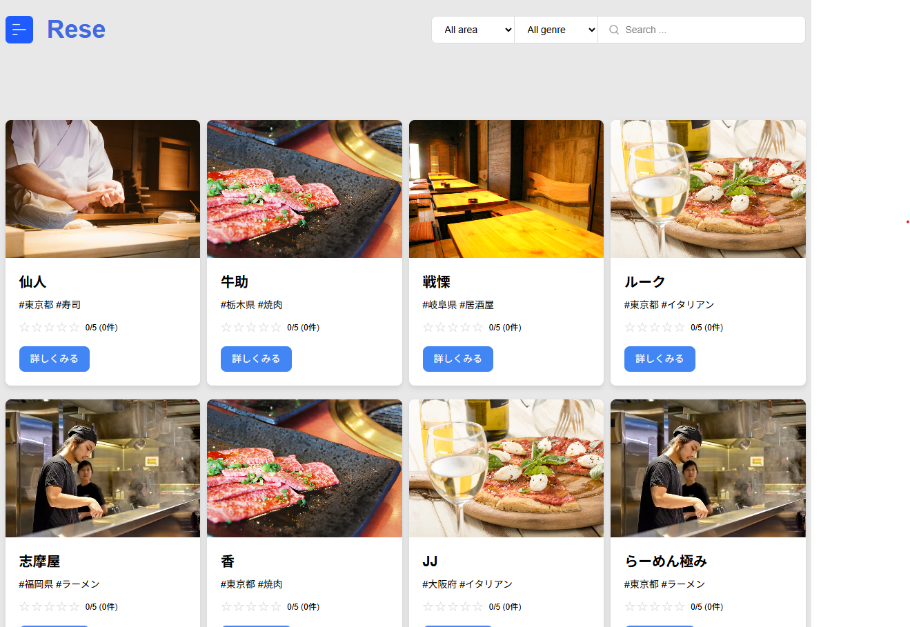
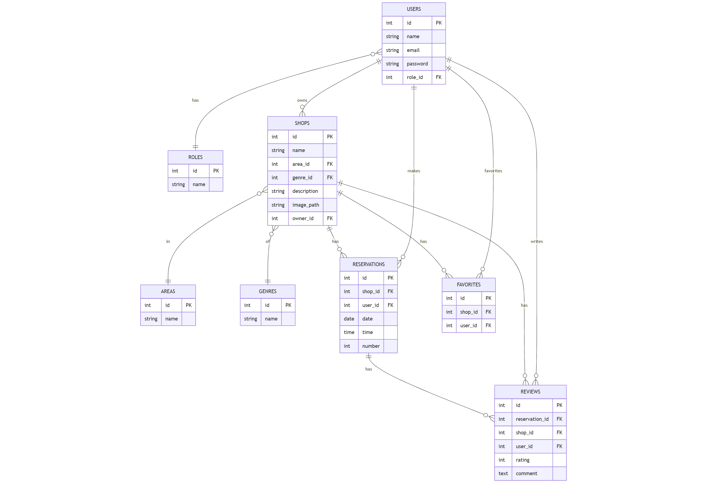

# Rese

「Rese」は、飲食店などの店舗を検索・予約できる Web アプリケーションです。<br>
ユーザーはエリアやジャンル、キーワードで店舗を探し、予約やレビュー投稿、お気に入り登録が可能です。<br>
店舗オーナーは自身の店舗情報や予約を管理でき、管理者はオーナーの管理ができます<br>>
オンライン決済や QR コード発行、リマインダーメール送信など、実用的な機能を備えています。


## 作成した目的

外部の飲食店予約サービスは手数料を取られるため、自社で予約サービスを持ちたいというニーズに応えるために本アプリケーションを開発しました<br>>
これにより、手数料コストを削減し、顧客との直接的な関係構築や独自のサービス展開が可能となります。

## アプリケーション URL

- 本番環境：http://ec2-18-183-15-145.ap-northeast-1.compute.amazonaws.com/
- 開発環境：http://localhost/
- phpMyAdmin：http://localhost:8080/
- mailhog：http://localhost:8025/

## 機能一覧

- ユーザー登録・ログイン（メール認証対応）
- 店舗一覧・検索（エリア・ジャンル・キーワード）
- 店舗詳細表示
- 店舗予約（日時・人数指定、予約変更・キャンセル）
- お気に入り店舗登録
- レビュー投稿・編集
- 予約ごとの QR コード発行
- Stripe によるオンライン決済
- 予約リマインダーメール・お知らせメール送信
- 権限別（管理者・オーナー・一般ユーザー）機能
  - 管理者：店舗オーナーの作成
  - オーナー：自身の店舗管理（新規作成・編集）、予約管理、ユーザーへの通知
  - 一般ユーザー：予約・レビュー・お気に入り管理

## 使用技術

- PHP 8.3.23
- Laravel 8.83.29
- MYSQL 8.0.26
- nginx 1.21.1
- AWS
  - VPC
  - EC2
  - S3
  - RDS
  - Route53
  - SES

## テーブル設計

### users

| カラム名          | 型           | primary key | unique key | not null | foreign key |
| ----------------- | ------------ | ----------- | ---------- | -------- | ----------- |
| id                | bigint       | ○           |            | ○        |             |
| name              | varchar(255) |             |            | ○        |             |
| email             | varchar(255) |             | ○          | ○        |             |
| email_verified_at | timestamp    |             |            |          |             |
| password          | varchar(255) |             |            | ○        |             |
| role_id           | bigint       |             |            | ○        | roles(id)   |
| created_at        | timestamp    |             |            |          |             |
| updated_at        | timestamp    |             |            |          |             |

### roles

| カラム名   | 型           | primary key | unique key | not null | foreign key |
| ---------- | ------------ | ----------- | ---------- | -------- | ----------- |
| id         | bigint       | ○           |            | ○        |             |
| name       | varchar(255) |             |            | ○        |             |
| created_at | timestamp    |             |            |          |             |
| updated_at | timestamp    |             |            |          |             |

### shops

| カラム名    | 型           | primary key | unique key | not null | foreign key |
| ----------- | ------------ | ----------- | ---------- | -------- | ----------- |
| id          | bigint       | ○           |            | ○        |             |
| name        | varchar(255) |             |            | ○        |             |
| area_id     | bigint       |             |            | ○        | areas(id)   |
| genre_id    | bigint       |             |            | ○        | genres(id)  |
| description | varchar(255) |             |            | ○        |             |
| image_path  | varchar(255) |             |            | ○        |             |
| owner_id    | bigint       |             |            | ○        | users(id)   |
| created_at  | timestamp    |             |            |          |             |
| updated_at  | timestamp    |             |            |          |             |

### areas

| カラム名   | 型           | primary key | unique key | not null | foreign key |
| ---------- | ------------ | ----------- | ---------- | -------- | ----------- |
| id         | bigint       | ○           |            | ○        |             |
| name       | varchar(255) |             |            | ○        |             |
| created_at | timestamp    |             |            |          |             |
| updated_at | timestamp    |             |            |          |             |

### genres

| カラム名   | 型           | primary key | unique key | not null | foreign key |
| ---------- | ------------ | ----------- | ---------- | -------- | ----------- |
| id         | bigint       | ○           |            | ○        |             |
| name       | varchar(255) |             |            | ○        |             |
| created_at | timestamp    |             |            |          |             |
| updated_at | timestamp    |             |            |          |             |

### reservations

| カラム名   | 型        | primary key | unique key | not null | foreign key |
| ---------- | --------- | ----------- | ---------- | -------- | ----------- |
| id         | bigint    | ○           |            | ○        |             |
| shop_id    | bigint    |             |            | ○        | shops(id)   |
| user_id    | bigint    |             |            | ○        | users(id)   |
| date       | date      |             |            | ○        |             |
| time       | time      |             |            | ○        |             |
| number     | int       |             |            | ○        |             |
| created_at | timestamp |             |            |          |             |
| updated_at | timestamp |             |            |          |             |

### reviews

| カラム名       | 型        | primary key | unique key | not null | foreign key      |
| -------------- | --------- | ----------- | ---------- | -------- | ---------------- |
| id             | bigint    | ○           |            | ○        |                  |
| reservation_id | bigint    |             |            | ○        | reservations(id) |
| user_id        | bigint    |             |            | ○        | users(id)        |
| shop_id        | bigint    |             |            | ○        | shops(id)        |
| rating         | inte      |             |            | ○        |                  |
| comment        | text      |             |            | ○        |                  |
| created_at     | timestamp |             |            |          |                  |
| updated_at     | timestamp |             |            |          |                  |

### favorites

| カラム名   | 型        | primary key | unique key | not null | foreign key |
| ---------- | --------- | ----------- | ---------- | -------- | ----------- |
| id         | bigint    | ○           |            | ○        |             |
| shop_id    | bigint    |             |            | ○        | shops(id)   |
| user_id    | bigint    |             |            | ○        | users(id)   |
| created_at | timestamp |             |            |          |             |
| updated_at | timestamp |             |            |          |             |

## ER 図



## 環境構築

Docker ビルド  
1.git clone https://github.com/wataru-xxxg/Rese.git
1.docker-compose up -d --build

Lavaral 環境構築  
1.docker-compose exec php bash  
1.composer install  
1.cp .env.example .env  
1..env.example ファイルから.env を作成し、環境変数を変更
1.php artisan key:generate  
1.php artisan migrate  
1.php artisan db:seed

## Stripe について

Stripe の API キーは以下のように設定をお願いいたします。

```
STRIPE_PUBLIC_KEY="パブリックキー"
STRIPE_SECRET_KEY="シークレットキー"
```

## AWS について

AWS の API キーは以下のように設定をお願いいたします。

```
AWS_ACCESS_KEY_ID="AWSで作成したS3用ユーザーのAccess key ID"
AWS_SECRET_ACCESS_KEY="AWSで作成したS3用ユーザーのSecret access key"
AWS_DEFAULT_REGION=ap-northeast-1(東京リージョンの場合)
AWS_BUCKET="作成したバケット名"
```

## ログイン情報

### 一般ユーザー

- email：test@test.com
- password：password

### 管理者

- email：admin@admin.com
- password：password

### オーナー

- email：owner@owner.com
- password：password
